# Introduction

In this section of the lab, you will setup your GitHub environment, deploy the sample application into your New Relic Account, and create your first Change Tracking marker using a GitHub Action.

## Background

[GitHub Actions](https://github.com/features/actions) have become a critical component in many modern CI/CD pipelines. Creating seamless integrations in the same platform where you manage your source code allows for quick wins in automation, scalability, customizations, and visibility into the overall pipeline. Helping teams create higher quality code faster and with more efficiency.

The recent release of New Relic's [GitHub Action for Change Tracking](https://docs.newrelic.com/docs/change-tracking/ci-cd/change-tracking-github-actions/) allows teams to add immediate value to their telemetry in New Relic by automatically marking their monitored entities with the changes they care about.

## Setting up your GitHub environment

To get started, you'll first need to [fork this repository](https://docs.github.com/en/get-started/quickstart/fork-a-repo#forking-a-repository). This will give you a clone of the repository under your own user account where you'll have the administrative permissions needed to make some changes later on.

1. Once you've logged into GitHub, you'll see the `Fork` button in the upper right hand corner.

<p align="center">
  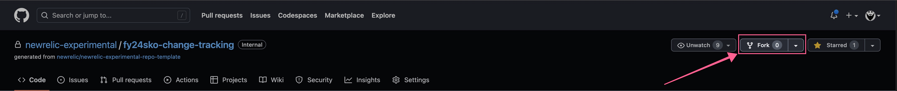
</p>

2. After clicking on the button, you'll be presented with the options for creating a new fork. There is an option to rename the repository to whatever you want it to be in your own account, but that's an optional change and not recommended.

<p align="center">
  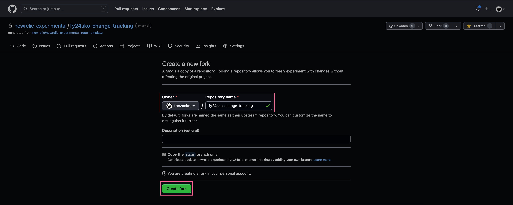
</p>

Upon creation, you'll be automatically redirected to your fork of this repository, to confirm, the URL will look like this:

```
https://github.com/$USERNAME/fy24sko-change-tracking
```

And the name of the repository in the upper left will look like this:

```
$USERNAME/fy24sko-change-tracking
```

Replacing `$USERNAME` in both examples with your GitHub username.

Next, you will collect your license and user API keys from New Relic, create secrets in your GitHub repository, and start the sample application we're using in this lab.

## Deploying the sample application into your New Relic Account


### GitHub Secrets

1. The first step is to [login to your New Relic account](https://login.newrelic.com/login) and then navigate to the `API Keys` UI through the menu on your username in the bottom left.

<p align="center">
  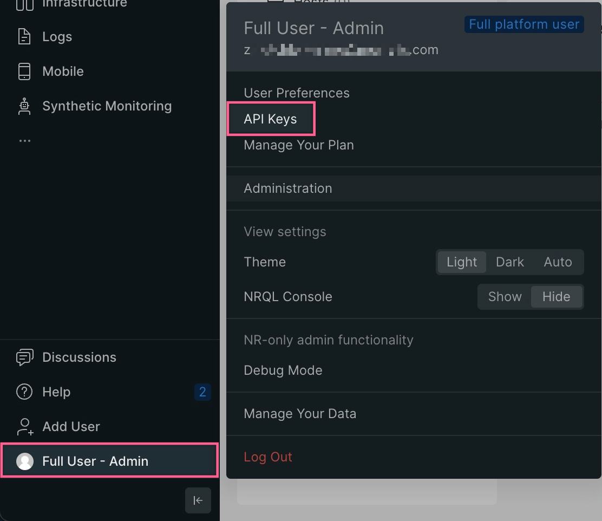
</p>

2. Next, you'll find your personal user API key and the account ingest license keys and copy those somewhere safe.

<p align="center">
  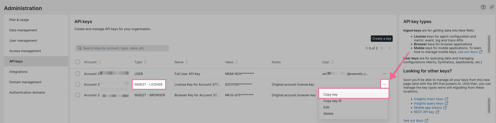
</p>

3. Back in your GitHub repository, you'll navigate to the `Settings` tab and then select the `Secrets and variables >> Actions` sub-menu item. Then click the large `New repository secret` button in the upper right.

<p align="center">
  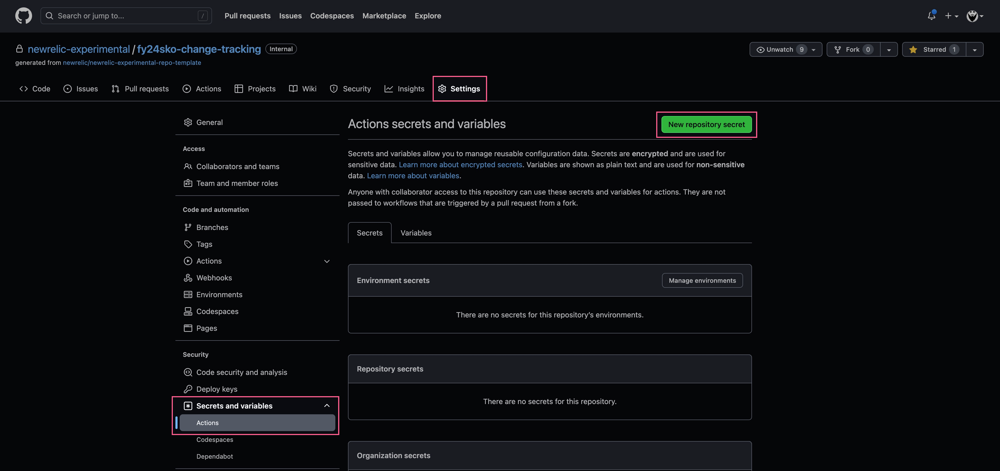
</p>

4. In the `New secret` UI, you will setup secrets to be used as environment variables in our GitHub Actions, which we'll explain later. You'll want to use the names listed below along with their associated key values that you've copied from your New Relic account.

**The capitalization and spelling of these keys is critical for this lab**

| Name              |
|-------------------|
| NR_LICENSE_KEY    |
| NEW_RELIC_API_KEY |

<p align="center">
  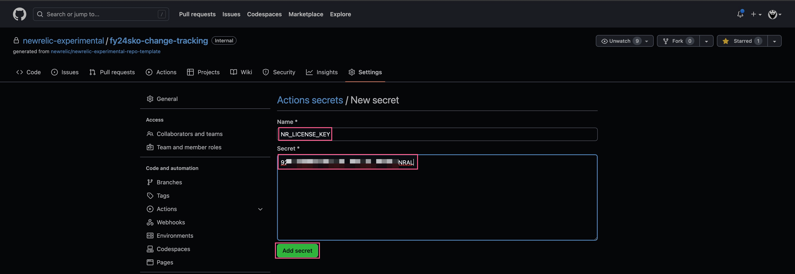
</p>

>*In this image, we've focused on the New Relic License Key, but you'll need to create a second secret for your User API Key; following the same procedure.*

5. When you're finished, you should have the API key and License key secrets shown here.

<p align="center">
  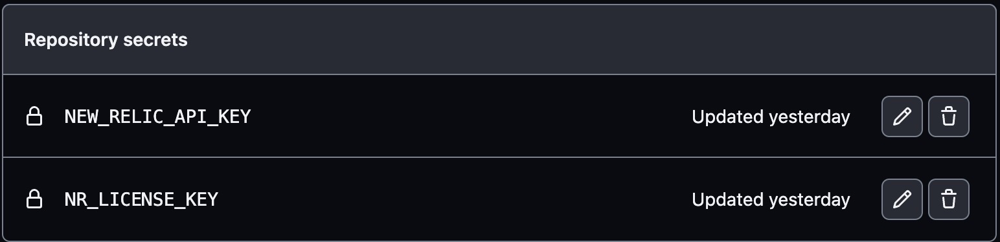
</p>

### Deploying the sample app with a GitHub Action

Now we need to start the sample application that will send telemetry to your New Relic account.

1. First, navigate to the `Actions` menu item in your GitHub repository and select the `Run App for Lab` action from the sub-menu.

<p align="center">
  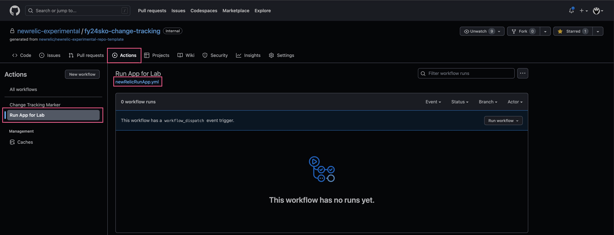
</p>

2. Under the name of the action, you can see a small link to the `.yml` configuration file for this action. If you click on it, we can investigate the contents.

>*This file, along with all other GitHub Actions, is also stored in the repository's [workflows directory](/.github/workflows/)*

```yaml
name: Run App for Lab

on:
  workflow_dispatch:

jobs:
  build:
    runs-on: ubuntu-latest

    steps:
      - name: Checkout code
        uses: actions/checkout@v3.3.0

      - name: Update packages
        run: |
          sudo apt-get update

      - name: Remove conflicts and Install Docker
        run: |
          sudo apt-get remove moby-containerd moby-runc
          sudo apt-get install -y docker.io

      - name: Install Docker Compose
        run: |
          sudo curl -L "https://github.com/docker/compose/releases/download/1.29.2/docker-compose-$(uname -s)-$(uname -m)" -o /usr/local/bin/docker-compose
          sudo chmod +x /usr/local/bin/docker-compose

      - name: Run Docker Compose with a 60m timer
        env:
          NR_LICENSE_KEY: ${{ secrets.NR_LICENSE_KEY }}
          NR_APP_NAME: "fy24-sko-change-tracking"
        run: |
          docker-compose -f compose.yml up -d
          sleep 1h # Leave these containers running for 1 hour to give time to finish the lab
      
      - name: Stop containers
        run: |
          docker-compose -f compose.yml down || true
```

Breaking this file down into it's components, you can see the following workflow:

| <div style="width:150px">Attribute</div> | Notes |
|-----------|-----------|
| name | The name of this workflow, seen in the `Actions` page |
| on | The GitHub event that triggers this workflow. In this case we're using [workflow_dispatch](https://docs.github.com/en/actions/using-workflows/events-that-trigger-workflows#workflow_dispatch) in our lab since we only want manual executions. |
| jobs.<job_id> | `build` is the job_id for this segment of the workflow. You can have multiple jobs stacked together depending on your needs. |
| jobs. <job_id>.runs-on | This defines the type of machine (aka 'runner') to run the job on. GitHub hosts Windows Server, Ubuntu, and MacOS runners for public use; or you can provide your own image. |
| jobs. <job_id> .env | This option sets variables for steps to use in the runner environment, like the `NR_LICENSE_KEY` GitHub secret we created earlier. At this level the variables are available for every step in this job, but you can also set persistence at the entire workflow and individual step levels. |
| jobs. <job_id>.steps | A job is composed of one or more "steps"; which can run commands, setup other actions, and do multiple other things. GitHub has built-in steps for set up and tear down of jobs. |
| jobs. <job_id> .steps.name | This is the name of the step that will be displayed on the job details page in the GitHub UI. |
| jobs. <job_id> .steps.uses | This is where you can select an action to run as part of your job. In our first step you can see we use the [checkout](https://github.com/actions/checkout) action to checkout our repository that we want to work in. |
| jobs. <job_id> .steps.run | This option allows you to run command-line programs in the operating system's shell. |

>*To learn more about the options available in the GitHub Action syntax, check out [the documentation](https://docs.github.com/en/actions/using-workflows/workflow-syntax-for-github-actions)*

3. Back in our `Actions` page, select the `Run workflow` drop down and click the green `Run Workflow` button to start this action.

<p align="center">
  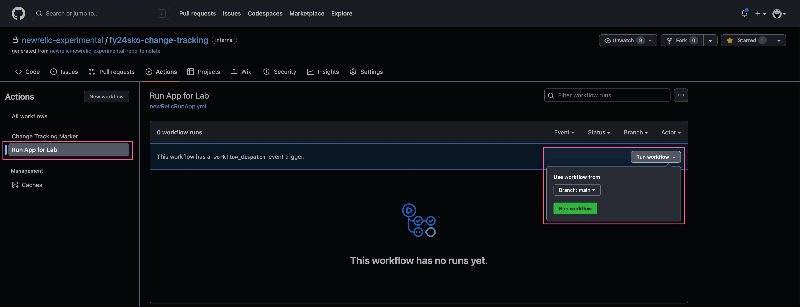
</p>

4. After about 2-5 seconds, you'll see the new workflow running in the history panel. Clicking on the name opens up the details of this particular execution, or "run", of this workflow.

<p align="center">
  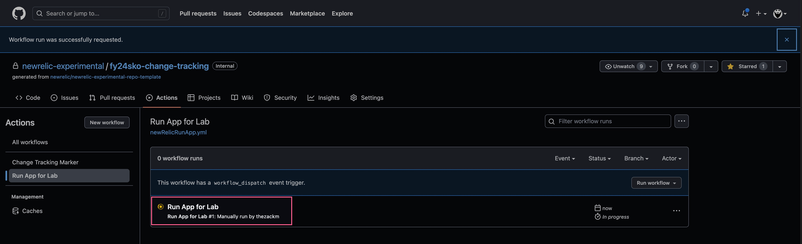
</p>

5. Since our action only has a single `build` job, that's the only tile available here. Clicking on it will open up the running log of the job.

<p align="center">
  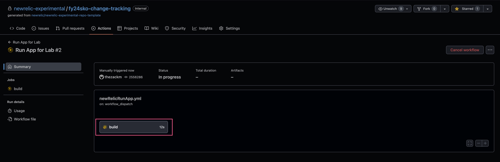
</p>

6. This build usually takes about 2 minutes to execute; you'll know it's completed when you can see these `Creating...` log entries at the end of the `Run Docker Compose with a 60m timer` step:

```log
Creating fy24sko-change-tracking_web_1 ...
Creating fy24sko-change-tracking_load_1 ...
Creating fy24sko-change-tracking_web_1 ... done
Creating fy24sko-change-tracking_load_1 ... done
```

<p align="center">
  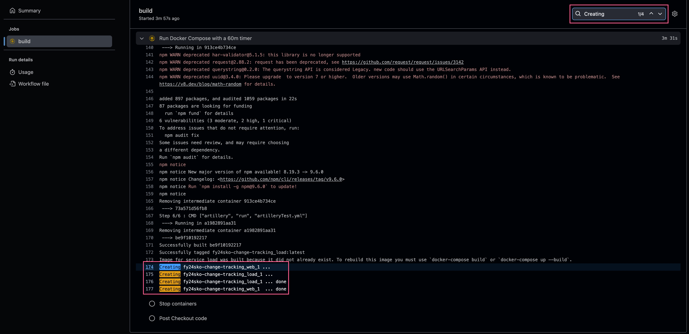
</p>

7. After about 2-5 minutes, you should be able to see your new application, with transactions and load, in your New Relic account.

<p align="center">
  
</p>

### Creating a Change Tracking Marker with a GitHub Action

Now that we have an application service entity, let's see how easy it is to create markers for it. The first thing we need to do is gather the `entity.guid` for our sample application. It's one of the required fields to create any markers in the new API.

1. In the New Relic UI, navigate to your APM Service entity overview page, then click the small 'tags' icon under the title to see the details slideout on the right side. From there you can copy the `entity.guid` value.

<p align="center">
  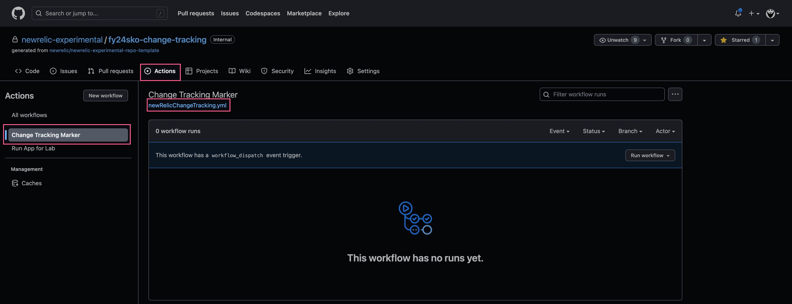
</p>

2. Next you will need to create a GitHub Secret, exactly how you did for your API and license keys. This one will be named `NEW_RELIC_DEPLOYMENT_ENTITY_GUID`. As a reminder, when you're done you should have a list of secrets like this:

<p align="center">
  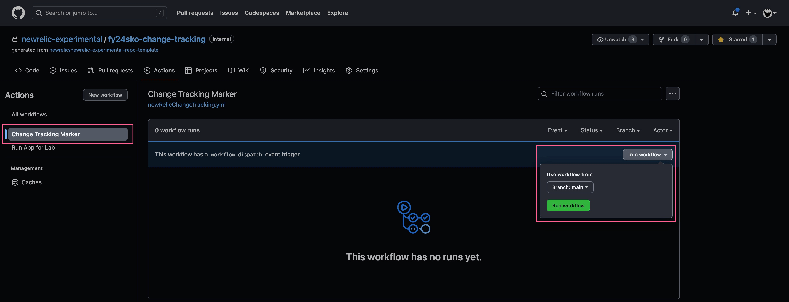
</p>

3. Navigating back to our `Actions` page, we can select the `Change Tracking Marker` and click the link to view the source code for this action.

<p align="center">
  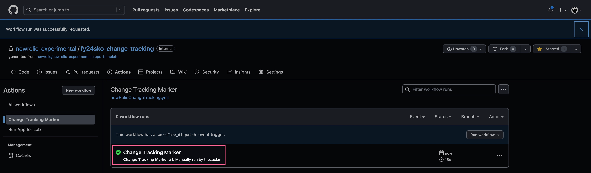
</p>

```yaml
name: Change Tracking Marker
on:
  workflow_dispatch:

jobs:
  newrelic:
    runs-on: ubuntu-latest
    name: New Relic
    steps:
      - name: Create marker
        uses: newrelic/deployment-marker-action@v2.1.0
        with:
          apiKey: ${{ secrets.NEW_RELIC_API_KEY }}
          guid: ${{ secrets.NEW_RELIC_DEPLOYMENT_ENTITY_GUID }}
          version: "0.0.1"
          user: "${{ github.actor }}"
          description: "Automated Marker via Github Actions"
          deploymentType: "OTHER"
```

>Breaking this file down into it's components, you can see that it uses an Ubuntu runner to execute a single step using the [New Relic Deployment Marker](https://github.com/newrelic/deployment-marker-action) action, where we pass [multiple fields](https://docs.newrelic.com/docs/change-tracking/ci-cd/change-tracking-github-actions/#github-actions-input) to create a marker. 
>
>These fields include using both the `NEW_RELIC_API_KEY` and `NEW_RELIC_DEPLOYMENT_ENTITY_GUID` GitHub secrets, along with the `github.actor` default variable; which we access using its [context syntax](https://docs.github.com/en/actions/learn-github-actions/contexts#github-context).

4. Back in our `Actions` interface, let's go ahead and run the workflow like we did previously.

<p align="center">
  
</p>

5. This one executes pretty fast, but we can still click the name to go see the details of what happened.

<p align="center">
  
</p>

6. Clicking on the job name here will open up the logs.

<p align="center">
  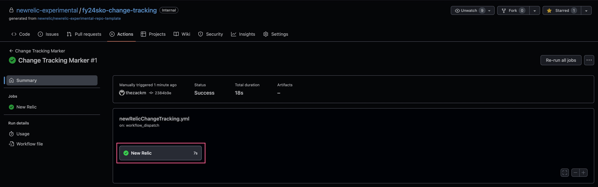
</p>

7. And expanding the `Create marker` step will show us the values we've passed into New Relic, which match the values we have in our YAML configuration file.

<p align="center">
  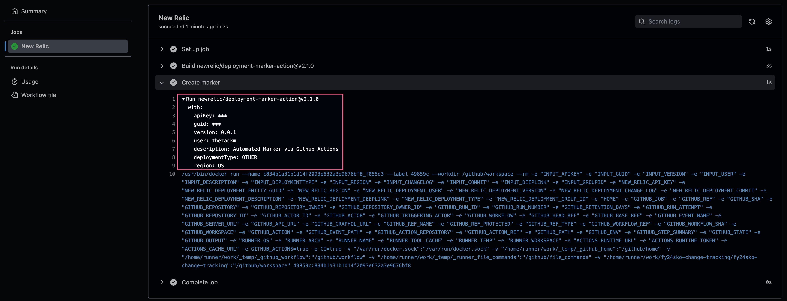
</p>

>*GitHub Secrets will always be obfuscated in this log*

8. Giving the APM interface a few minutes to refresh, we can see our marker on our application!

<p align="center">
  
</p>

## Next steps

Continue creating your next Change Tracking marker using the [NerdGraph API](./3_NERDGRAPH%20API.md).
