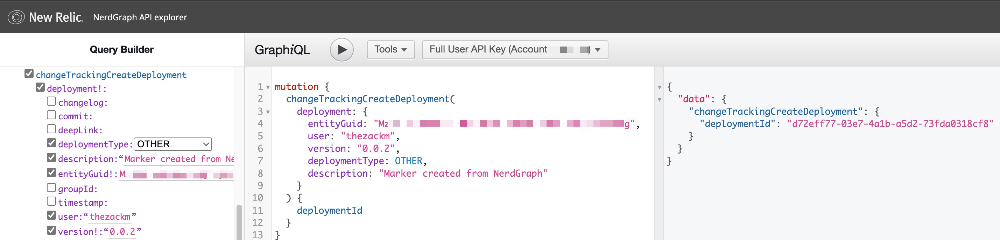

# Introduction

Not all teams use GitHub, or have mature CI/CD pipelines, or maybe they want to create markers for things outside of their deployment pipelines all together. In those cases, a natural alternative for automation will be using our [NerdGraph API](https://docs.newrelic.com/docs/change-tracking/change-tracking-graphql/).

## Setting up your GraphQL mutation

There are [multiple required and optional fields available](https://docs.newrelic.com/docs/change-tracking/change-tracking-graphql/#field-definitions) in the NerdGraph API. For this exercise, we're going to use the payload below:

```graphql
mutation {
  changeTrackingCreateDeployment(
    deployment: {
      entityGuid: "$ENTITY_GUID",
      user: "$USER_NAME",
      version: "0.0.2",
      deploymentType: OTHER,
      description: "Marker created from NerdGraph"
    }
  ) {
    deploymentId
  }
}
```

In this example, you'll need to replace `$ENTITY_GUID` and `$USER_NAME` with the appropriate values for your APM service entity and whatever user you would like reflected on the marker.

## Using the GraphiQL interface to submit your marker

**NOTE: THERE IS A CURRENT BUG WHEN SWITCHING BETWEEN THE PRODUCT AND CUSTOMER VIEWS FROM V1 > V2 USER ACCOUNTS. IF YOU DO NOT HAVE THE OPTION TO SELECT YOUR API KEY IN THE GRAPHIQL UI YOU CAN EITHER TRY AN INCOGNITO WINDOW OR USE THE CURL METHOD BELOW.**

At New Relic, we present a public-facing, in-browser experience for our GraphQL API in the form of [GraphiQL](https://github.com/graphql/graphiql), which is the GraphQL IDE created by engineers at Facebook in 2015. One of the nice things about this IDE is that you can directly link queries and mutations to any user and the IDE will maintain your syntax, no matter what account-level permissions the recipient may have. Meaning that you can share things with folks from different organizations with easy links like this:

 * [NerdGraph - GraphiQL Link for Change Tracking Mutation](https://api.newrelic.com/graphiql?#query=mutation%20%7B%0A%20%20changeTrackingCreateDeployment%28deployment%3A%20%7BentityGuid%3A%20%22%24ENTITY_GUID%22%2C%20user%3A%20%22%24USER_NAME%22%2C%20version%3A%20%220.0.2%22%2C%20deploymentType%3A%20OTHER%2C%20description%3A%20%22Marker%20created%20from%20NerdGraph%22%7D%29%20%7B%0A%20%20%20%20deploymentId%0A%20%20%7D%0A%7D%0A)

Clicking on the above link will take you to the IDE, where you can select the API key for your account, make edits to your mutation as needed, and execute the mutation against our API to create your marker. The panel on the right will show you the results of your mutation, in this case we've only elected to return the `deploymentId` generated by New Relic at the time of marker creation, which indicates a successful operation.

<p align="center">
  
</p>

## Using cURL to submit your marker directly to the NerdGraph API

Alternatively, you can submit an HTTP POST directly to the NerdGraph API endpoint. This is necessary if you are using a V2 user account that doesn't have full access to the GraphiQL explorer UI right now.

Here is an example command for you to run in your terminal; you will need to replace the `$API_KEY`, `$ENTITY_GUID`, and `$USER_NAME` fields with content relative to you:

```
curl https://api.newrelic.com/graphql \
  -H 'Content-Type: application/json' \
  -H 'API-Key: $API_KEY' \
  --data-binary '{"query":"mutation {\n  changeTrackingCreateDeployment(deployment: {entityGuid: \"$ENTITY_GUID\", user: \"$USER_NAME\", version: \"0.0.2\", deploymentType: OTHER, description: \"Marker created from NerdGraph\"}) {\n    deploymentId\n  }\n}\n", "variables":""}'
```


After a few minutes, you can verify success by navigating to your APM service in New Relic, and investigating the marker there, noting the new marker with version `0.0.2`

<p align="center">
  
</p>

## Next steps

Continue creating your next Change Tracking marker using the [New Relic CLI](./4_NEW%20RELIC%20CLI.md).
