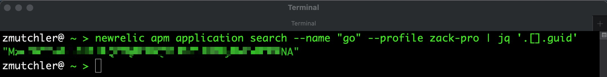
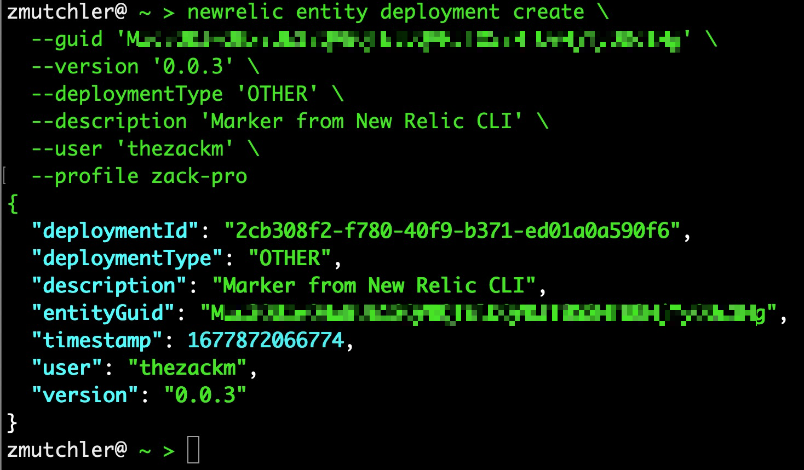
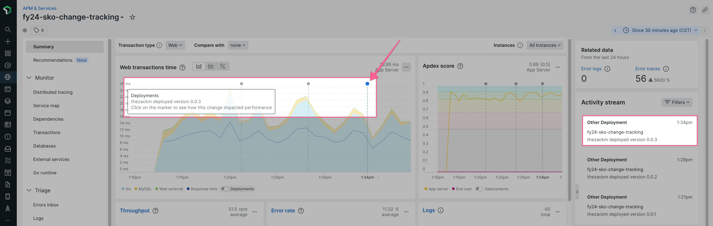

# Introduction

Another intuitive way to create markers in New Relic is with the new `entity deployment create` command from the New Relic CLI. This is the same CLI used for a whole range of other activities, including the primary delivery mechanism of our installations through the Guided Install experience in New Relic.

## Setting up the New Relic CLI

If you've never installed the CLI before, you can get started easily by following the first 2 steps [in this guide](https://developer.newrelic.com/automate-workflows/get-started-new-relic-cli/), which will help you install the binary and setup your user profile to authenticate into New Relic.

If you have installed the CLI previously, you'll want to ensure you're on the latest version available. 

On MacOS, `homebrew` is an easy solution:

```shell
brew upgrade newrelic-cli
```

>*If you're using Windows or Linux, you can find instructions on the guide linked above.*

Next, make sure you have a good profile setup for the account you're interacting with:

```shell
newrelic profile list
```

You should see a profile name that aligns with the account you want, make note of it for later. If you do not see a profile, you can create one using this syntax:

```shell
newrelic profile add \
  --profile $PROFILE_NAME \
  --region $REGION \
  --apiKey $API_KEY \
  --accountId $ACCOUNT_ID \
  --licenseKey $LICENSE_KEY
```

Replacing the variable placeholders with appropriate values:

| Placeholder | Notes |
|-------------|-------|
| `$PROFILE_NAME` | The display name you want to use for this profile |
| `$REGION` | The region for your New Relic Account (US \| EU) |
| `$API_KEY` | Your user API key for the account |
| `$ACCOUNT_ID` | The numeric Account ID |
| `$LICENSE_KEY` | The ingest license key for the account |

## Finding your Entity GUID

One of the benefits of using the New Relic CLI is how it naturally interacts with common use-cases for our users. For instance, you can easily find your `entity.guid` directly from the CLI using the `apm application search` command. The `--name` parameter uses fuzzy logic for pattern matching and piping the results into [jq](https://stedolan.github.io/jq/) allows you to return only the data you care about at the time.

```shell
newrelic apm application search \
  --name "$APP_NAME" \
  --profile "$PROFILE_NAME" \
  | jq '.[].guid'
```

<p align="center">
  
</p>

>*You could take this a step further and pipe the results into a variable for your marker, or even directly into the `entity deployment create` command as an elaborate one-liner*

## Creating a Change marker

Finally, the ease of creating a marker with the New Relic CLI is in parity with the previous exercises. Executing a single command with the required fields takes seconds, and automatically returns a payload indicating success.

```shell
newrelic entity deployment create \
  --guid '$ENTITY_GUID' \
  --version '0.0.3' \
  --deploymentType 'OTHER' \
  --description 'Marker from New Relic CLI' \
  --user '$USER_NAME' \
  --profile '$PROFILE_NAME'
```

>*To see all the available options for this command, run `newrelic entity deployment create --help*

<p align="center">
  
</p>

You can verify this by navigating to your APM service in New Relic, and investigating the marker there, noting the new marker with version `0.0.3`

<p align="center">
  
</p>

## Next steps

Finish up the lab in the [Conclusion](./5_CONCLUSION.md).
