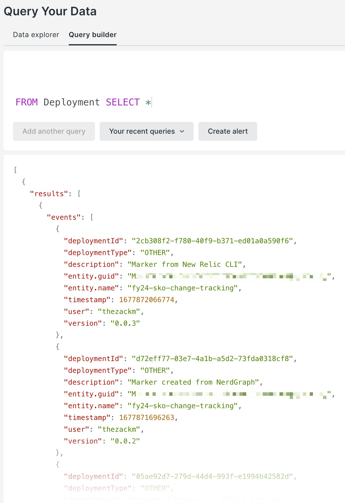

# Summary

As you can see, the evolution of the legacy New Relic APM Deployment Markers into the Change Tracking feature available today has shifted our approach from *"Who touched that app?"* to *"Who touched that entity? Why did they touch it? What did it look like before? What was the impact of them touching it? etc..."*

And we're just getting started. We've got plans to continue expansion of Change Tracking markers throughout the entire New Relic platform experience, and into new and potentially unorthodox change events that can immediately impact the way our customers run both their root-cause analysis, and their overall business.

## Next steps

Consider other ways to visualize the data.

 * Are there other types of changes you'd like to track?
 * Are the curated views in New Relic enough? What about [creating custom dashboards](https://docs.newrelic.com/docs/change-tracking/change-tracking-view-analyze/#query-deployments) with this data? What kind of business value can you achieve that we haven't thought of yet?

```sql
FROM Deployment SELECT *
```

<p align="center">
  
</p>

Continue your journey with Change Tracking! For a more advanced approach, take a look at our [Jenkins plugin](https://docs.newrelic.com/docs/change-tracking/ci-cd/change-tracking-jenkins/) and stay tuned for more integrations with your favorite CI/CD tools, as well as updates to the Change Tracking API in the near future!
